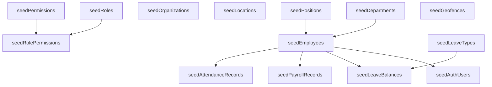

# 🌱 Human HR System - Seed Scripts Documentation

## 📋 Overview

Complete seed scripts for populating the Human HR System with sample data for development and testing purposes.

## 🗂️ Directory Structure

```
packages/scripts/src/seed/
├── rbac/                    # RBAC & Permissions
│   ├── seedRoles.ts
│   ├── seedPermissions.ts
│   └── seedRolePermissions.ts
├── settings/                # System Settings (NEW)
│   ├── seedOrganizations.ts
│   └── seedLocations.ts
├── policies/                # Work Policies
│   ├── seedWorkSchedulePolicies.ts
│   ├── seedOvertimePolicies.ts
│   ├── seedShifts.ts
│   ├── seedPenaltyPolicies.ts
│   └── seedHolidays.ts
├── people/                  # Organizational Structure
│   ├── seedDepartments.ts
│   ├── seedPositions.ts
│   └── seedEmployees.ts
├── users/                   # Authentication
│   └── seedAuthUsers.ts
├── leave/                   # Leave Management (NEW)
│   ├── seedLeaveTypes.ts
│   └── seedLeaveBalances.ts
├── attendance/              # Attendance System
│   ├── seedGeofences.ts
│   └── seedAttendanceRecords.ts
├── payroll/                 # Payroll System (NEW)
│   └── seedPayrollRecords.ts
├── seedAll.ts               # Master seed script
├── clearEmulatorData.ts     # Clear all data
└── verifySeededData.ts      # Verify seeded data
```

## 🚀 Quick Start

### 1. Start Firebase Emulators

```bash
pnpm run emulators
# or
firebase emulators:start
```

### 2. Run All Seeds

```bash
cd packages/scripts
pnpm run seed:all

# or directly
tsx src/seed/seedAll.ts
```

### 3. Verify in Emulator UI

Open http://localhost:4000 and check Firestore collections.

---

## 📚 Seed Script Details

### Phase 1: RBAC & Permissions

#### 1. **seedRoles.ts**
Creates system roles:
- Admin (full access)
- HR Manager (people management)
- Manager (team management)
- Employee (basic access)
- Auditor (read-only)

**Collection**: `roles`

#### 2. **seedPermissions.ts**
Creates resource-based permissions for:
- Employees
- Attendance
- Leave
- Payroll
- Reports
- Settings

**Collection**: `permissions`

#### 3. **seedRolePermissions.ts**
Maps permissions to roles.

**Collection**: `rolePermissions`

---

### Phase 2: System Settings ✨ NEW

#### 4. **seedOrganizations.ts**
Creates company/organization information:
- Company name (TH/EN)
- Registration number
- Tax number
- Address
- Contact info
- Branding (logo, colors)
- Financial settings (currency, fiscal year)

**Collection**: `organizations`

**Sample Data**:
- Main Office: บริษัท ฮิวแมน เทคโนโลยี จำกัด
- Chiang Mai Branch

#### 5. **seedLocations.ts**
Creates office locations and branches:
- Type: headquarters, branch, warehouse, remote, coworking
- Full address
- GPS coordinates
- Geofence radius
- Capacity

**Collection**: `locations`

**Sample Data**:
- HQ Bangkok (Empire Tower)
- Branch Chiang Mai
- Branch Phuket
- Warehouse Samut Prakan
- Co-working Space Silom
- Remote Work

---

### Phase 3: Policies

#### 6-10. Work Policies
Standard work policies for Thai labor law compliance.

**Collections**: `workSchedulePolicies`, `overtimePolicies`, `shifts`, `penaltyPolicies`, `holidays`

---

### Phase 4: Organizational Structure

#### 11. **seedDepartments.ts**
Creates departments:
- Executive
- HR
- IT (with sub-departments)
- Finance
- Marketing
- Sales
- Operations

**Collection**: `departments`

#### 12. **seedPositions.ts**
Creates job positions with salary ranges.

**Collection**: `positions`

---

### Phase 5: People & Users

#### 13. **seedEmployees.ts**
Creates 10 sample employees with complete data:
- Personal information
- Employment details
- Compensation & benefits
- Tax & social security
- Bank account
- Work schedule

**Collection**: `employees`

#### 14. **seedAuthUsers.ts**
Creates Firebase Auth users for testing.

**Auth Users**:
- admin@human.com / admin123456
- hr@human.com / hr123456
- manager@human.com / manager123456
- employee@human.com / employee123456
- auditor@human.com / auditor123456

---

### Phase 6: Leave Management ✨ NEW

#### 15. **seedLeaveTypes.ts**
Creates Thai standard leave types:
- **ลาพักร้อน** (Annual Leave) - 10 days
- **ลาป่วย** (Sick Leave) - 30 days
- **ลากิจ** (Personal Leave) - 3 days
- **ลาคลอด** (Maternity Leave) - 90 days
- **ลาเพื่อดูแลบุตรของบิดา** (Paternity Leave) - 5 days
- **ลาแต่งงาน** (Marriage Leave) - 3 days
- **ลาบวช** (Ordination Leave) - 15 days
- **ลาทหาร** (Military Service) - 60 days
- **ลาเพื่อทำศพ** (Bereavement Leave) - 3 days
- **ลาเพื่อศึกษา** (Study Leave) - 30 days
- **ลาโดยไม่ได้รับค่าจ้าง** (Unpaid Leave)
- **ทำงานที่บ้าน** (Work From Home)

**Collection**: `leaveTypes`

**Features**:
- Paid/unpaid
- Carry forward support
- Certificate requirements
- Approval workflow
- Half-day support

#### 16. **seedLeaveBalances.ts**
Creates leave balance records for all employees.

**Formula**: For each employee × each leave type = balance record

**Collection**: `leaveBalances`

**Data**:
- Total days (earned + carried forward)
- Used days (random for demo)
- Remaining days
- Expiry date

**Dependencies**: Requires `employees` and `leaveTypes`

---

### Phase 7: Attendance

#### 17. **seedGeofences.ts**
Office geofence configurations for attendance tracking.

**Collection**: `geofences`

#### 18. **seedAttendanceRecords.ts**
Sample attendance records with clock-in/out times, breaks, and penalties.

**Collection**: `attendance`

---

### Phase 8: Payroll ✨ NEW

#### 19. **seedPayrollRecords.ts**
Creates payroll records for current and previous month.

**Collection**: `payroll`

**Calculation Includes**:

**Income**:
- Base salary
- Overtime pay (random 0-20 hours)
- Bonus
- Allowances (transportation, meal, position)

**Deductions**:
- Tax (progressive Thai tax)
- Social Security (5%, max 750 THB)
- Provident Fund (5%)
- Late penalties
- Absence penalties

**Status**:
- Previous month: `paid`
- Current month: `draft`, `pending`, or `approved` (random)

**Dependencies**: Requires `employees`

---

## 🎯 Running Individual Seeds

### Run Specific Script

```bash
# Phase 1: RBAC
tsx src/seed/rbac/seedRoles.ts
tsx src/seed/rbac/seedPermissions.ts
tsx src/seed/rbac/seedRolePermissions.ts

# Phase 2: Settings
tsx src/seed/settings/seedOrganizations.ts
tsx src/seed/settings/seedLocations.ts

# Phase 3: Policies
tsx src/seed/policies/seedWorkSchedulePolicies.ts
tsx src/seed/policies/seedOvertimePolicies.ts
tsx src/seed/policies/seedShifts.ts
tsx src/seed/policies/seedPenaltyPolicies.ts
tsx src/seed/policies/seedHolidays.ts

# Phase 4: Structure
tsx src/seed/people/seedDepartments.ts
tsx src/seed/people/seedPositions.ts

# Phase 5: People
tsx src/seed/people/seedEmployees.ts
tsx src/seed/users/seedAuthUsers.ts

# Phase 6: Leave
tsx src/seed/leave/seedLeaveTypes.ts
tsx src/seed/leave/seedLeaveBalances.ts

# Phase 7: Attendance
tsx src/seed/attendance/seedGeofences.ts
tsx src/seed/attendance/seedAttendanceRecords.ts

# Phase 8: Payroll
tsx src/seed/payroll/seedPayrollRecords.ts
```

---

## 🔄 Dependencies Between Seeds



**Critical Dependencies**:
1. `seedEmployees` must run BEFORE:
   - `seedLeaveBalances`
   - `seedPayrollRecords`
   - `seedAttendanceRecords`

2. `seedLeaveTypes` must run BEFORE:
   - `seedLeaveBalances`

3. `seedRoles` + `seedPermissions` must run BEFORE:
   - `seedRolePermissions`

---

## 🧹 Clear All Data

```bash
# Clear all collections
tsx src/seed/clearEmulatorData.ts
```

**Warning**: This will delete ALL data in the emulator!

---

## ✅ Verify Seeded Data

```bash
tsx src/seed/verifySeededData.ts
```

Checks:
- All collections exist
- Document counts
- Data integrity

---

## 📊 Expected Results

After running `seedAll.ts`:

| Collection | Documents | Description |
|------------|-----------|-------------|
| `roles` | 5 | System roles |
| `permissions` | ~50 | Resource permissions |
| `rolePermissions` | ~100 | Role-permission mappings |
| `organizations` | 2 | Company info |
| `locations` | 6 | Office locations |
| `workSchedulePolicies` | ~5 | Work schedules |
| `overtimePolicies` | ~3 | OT policies |
| `shifts` | ~4 | Shift definitions |
| `penaltyPolicies` | ~5 | Penalty rules |
| `holidays` | ~20 | 2025 holidays |
| `departments` | ~11 | Departments |
| `positions` | ~20 | Job positions |
| `employees` | 10 | Employee records |
| `users` | 15 | Auth users |
| `leaveTypes` | 12 | Leave types |
| `leaveBalances` | ~110 | 10 employees × 11 leave types |
| `geofences` | ~5 | Office geofences |
| `attendance` | ~100 | Sample attendance |
| `payroll` | 20 | 10 employees × 2 months |

**Total**: ~500+ documents

---

## 🐛 Troubleshooting

### Error: Connection Refused

```
Error: connect ECONNREFUSED 127.0.0.1:8888
```

**Solution**: Start emulators first
```bash
firebase emulators:start
```

### Error: No employees found

**Solution**: Run seeds in correct order
```bash
tsx src/seed/seedAll.ts
```

### Error: Firestore write batch limit

Seeds automatically batch writes in chunks of 500.

### Data not showing in app

**Check**:
1. Emulator is running: http://localhost:4000
2. App is connected to emulator
3. Firestore rules allow read access
4. Clear browser cache

---

## 🎨 Customization

### Add More Employees

Edit `seedEmployees.ts`:
```typescript
const sampleEmployees: SeedEmployeeData[] = [
  {
    firstName: 'Your',
    lastName: 'Name',
    // ... other fields
  },
];
```

### Change Leave Type Quotas

Edit `seedLeaveTypes.ts`:
```typescript
{
  code: 'ANNUAL',
  maxDaysPerYear: 15, // Change from 10 to 15
  // ...
}
```

### Add New Location

Edit `seedLocations.ts`:
```typescript
{
  id: 'loc-new-branch',
  code: 'BR-NEW',
  name: 'สาขาใหม่',
  // ... other fields
}
```

---

## 📝 Best Practices

1. **Always run seeds on emulator** - Never on production
2. **Clear before re-seeding** - Use `clearEmulatorData.ts`
3. **Run in correct order** - Use `seedAll.ts` for safety
4. **Verify after seeding** - Use `verifySeededData.ts`
5. **Keep schemas in sync** - Import from `@/shared/schemas`

---

## 🔗 Related Documentation

- [Seed Scripts Guide](../../../docs/standards/09-seed-scripts-and-emulator-guide.md)
- [Firestore Data Modeling](../../../docs/standards/07-firestore-data-modeling-ai.md)
- [Employee Data Structure](../../../docs/SEED_EMPLOYEES.md)

---

## ✨ What's New

### Version 2.0 (Current)

**New Seed Scripts**:
- ✅ `seedOrganizations.ts` - Company information
- ✅ `seedLocations.ts` - Office locations with geofence
- ✅ `seedLeaveTypes.ts` - 12 Thai leave types
- ✅ `seedLeaveBalances.ts` - Leave balance tracking
- ✅ `seedPayrollRecords.ts` - Payroll with Thai tax calculation

**Improvements**:
- Organized into 8 phases
- Better dependency management
- Comprehensive documentation
- Real-world Thai HR data

---

## 🎉 Summary

This seed system provides:
- ✅ Complete HR data for testing
- ✅ Thai labor law compliance
- ✅ Realistic payroll calculations
- ✅ Full leave management
- ✅ Multi-location support
- ✅ RBAC & permissions
- ✅ Ready-to-use test accounts

**Total Seed Time**: ~30-60 seconds for all 19 scripts

Happy coding! 🚀
